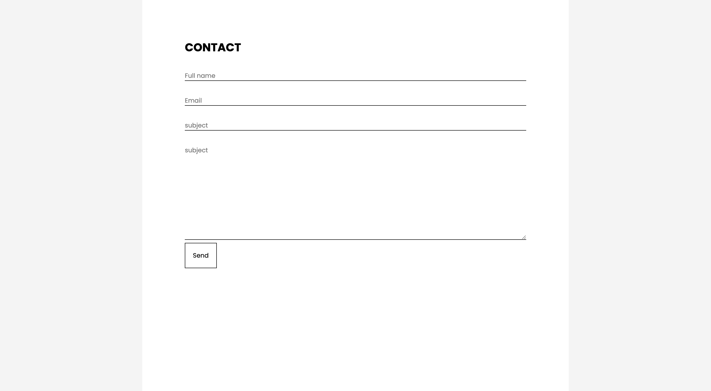

<p align="center">
  <a href="https://nodejs.org/en/" target="blank"></a>
</p>
<p align="center">
  <a title="MIT License" href="LICENSE">
    
  </a>
  <a title="Follow on Twitter" href="https://twitter.com/Nodejs">
    
  </a>
  <br />
  <br />
</p>

# NodeJS-Contactform-Template

## Description

Contact form Template using nodejs and nodemailer



## 🚀 Quick Start

1. **Install dependencies.**

   ```bash
   npm install
   ```

2. **Start project locally.**

   ```bash
   # development
    npm dev

   # watch mode
    npm start
   ```
3. **In your browser.**

   ```
   http://localhost:3000
   ```